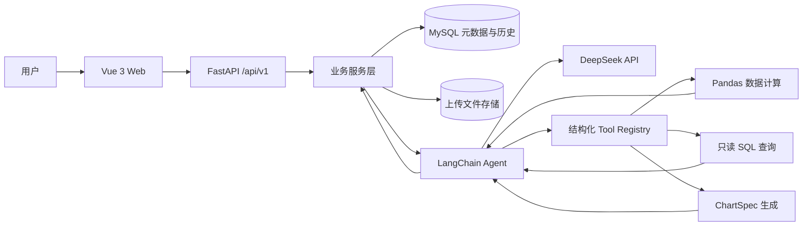

# 系统总体架构

## 边界

- Web 只负责交互和可视化，不计算权威业务结果。
- API 层负责认证、参数、响应和 HTTP 错误映射。
- Service 负责事务和用例编排。
- Agent 只编排模型与 Tool，不直接访问 HTTP 或任意执行代码。
- Tool 负责确定性计算并返回结构化、可裁剪的结果。
- MySQL 保存用户、数据集元数据、会话、消息和分析记录；原始大文件不塞入业务记录 JSON。

