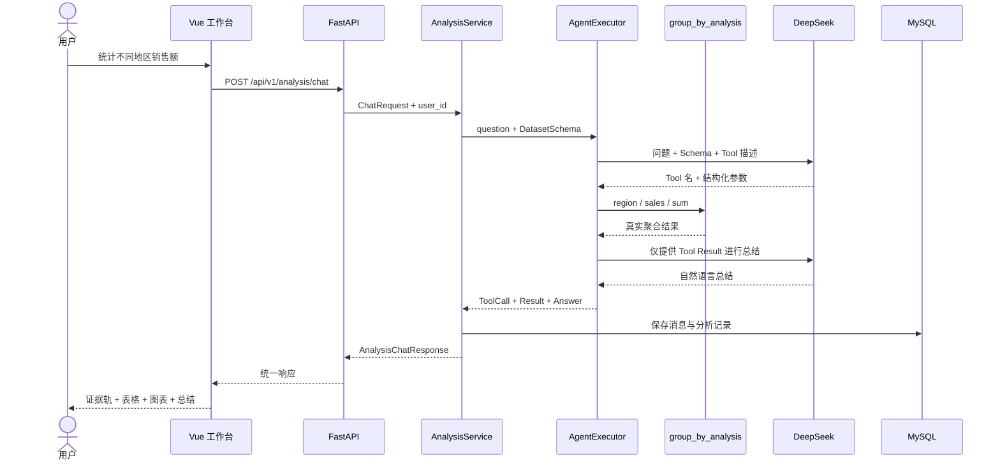

# 前后端数据流

```mermaid
sequenceDiagram
  actor User as 用户
  participant Vue as Vue 工作台
  participant API as FastAPI
  participant Service as AnalysisService
  participant Agent as AgentExecutor
  participant Tool as group_by_analysis
  participant LLM as DeepSeek
  participant DB as MySQL
  User->>Vue: 统计不同地区销售额
  Vue->>API: POST /api/v1/analysis/chat
  API->>Service: ChatRequest + user_id
  Service->>Agent: question + DatasetSchema
  Agent->>LLM: 问题 + Schema + Tool 描述
  LLM-->>Agent: Tool 名 + 结构化参数
  Agent->>Tool: region / sales / sum
  Tool-->>Agent: 真实聚合结果
  Agent->>LLM: 仅提供 Tool Result 进行总结
  LLM-->>Agent: 自然语言总结
  Agent-->>Service: ToolCall + Result + Answer
  Service->>DB: 保存消息与分析记录
  Service-->>API: AnalysisChatResponse
  API-->>Vue: 统一响应
  Vue-->>User: 证据轨 + 表格 + 图表 + 总结
```

前端只消费结构化 `tool_result` 与 `chart`。模型生成的文本不能作为图表数值源。

