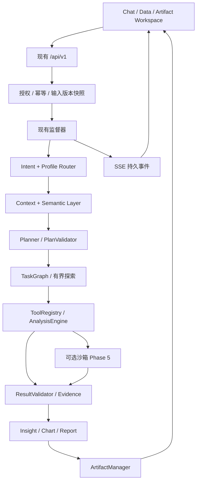

# AI-Native Enterprise Data Analysis Workspace 升级计划

基线：`310e86b2277738193a9078b27837d097bf8afee1`，项目 `F:/agentProject/DataAgent-v2.0.0`。用户已批准实施。原空目录不是源码基线，`plan/` 和旧保留数据目录保持原状。此文件整理已批准方案；实际实施状态与验证记录见 `UPGRADE_PROGRESS.md`。

## 1. Current Architecture

前端 Vue 3 / Vite / Pinia / Vue Router / Element Plus / ECharts；主要业务页面为 Options API。后端 Python 3.12 / FastAPI / SQLAlchemy / Alembic / MySQL / Pandas / SQLGlot，模型通过统一 Provider 接入。保持单实例、单 Uvicorn worker、现有持久队列与受监督子进程。

```text
backend/app/{routers,services,agent,analysis,datasets,execution,artifacts,charts,reports}
backend/{migrations,tests,scripts}
frontend/src/{views,components,stores,api,styles}
frontend/tests/{e2e,live}
deploy/ docs/ .ai/index/ sample-data/ compose.yaml
```

现有调用链：授权与幂等提交 → 固定 DatasetVersion → BackgroundJob → IntentRouter → DatasetResolver → ContextBuilder → Planner → PlanValidator → WorkflowExecutor → DatasetTools 兼容入口 → AnalysisEngine / ToolRegistry → 类型化结果校验 → 工件与执行证据 → ResultInterpreter → 服务端事实渲染。

现有 15 张业务表：users、datasets、dataset_columns、dataset_versions、analysis_sessions、analysis_messages、analysis_records、tool_execution_records、background_jobs、analysis_events、llm_call_records、cleanup_tasks、analysis_artifacts、analysis_reports、analysis_report_versions。源码迁移头为 0009；运行数据库版本实施前另行读取。

已实现：认证、所有权、数据版本、51 个规范工具与 11 个兼容工具、计划与依赖校验、有界纠正/重新规划、SSE、取消、执行证据、表格解析、通用统计/质量/EDA、报告版本和多格式导出。部分实现：工作台、语义识别、图表协议、清洗产品入口和领域报告。缺失：Profile 路由、语义修正、多输入计划、跨表业务分析、预测验证、完整会话工件恢复、代码沙箱。

规划扫描检查了目录、调用链、模型、迁移、API、前端、工具、测试、部署，并对 145 个 Python 文件做内存 AST 检查。历史验收不能作为当前测试结果。

## 2. Reusable Components

| 现有模块 | 处理 |
|---|---|
| 认证/Cookie/Origin/所有权 | 直接复用，新接口补回归 |
| DatasetService / Schema / Profile / Version | 扩展输入、语义与清洗版本 |
| ToolRegistry / AnalysisEngine / 类型化结果 | 所有领域共用，不建领域 Analyzer |
| Planner / PlanValidator / WorkflowExecutor | 定向扩展，保留旧协议 |
| 监督器 / 租约 / 心跳 / 清理补偿 | 复用生命周期 |
| AnalysisEvent / SSE / 轮询 | 扩展事件与恢复 |
| 事实引用 / 数值渲染 / ResultValidator | 作为洞察与报告事实基础 |
| JSON ArtifactStore / LocalArtifactStorage | 统一外观，保留不同内部职责 |
| ReportSpec / Builder / ExporterRegistry | 扩展可复用报告模板 |
| AppShell / AgentSteps / AnalysisResult / ReportWorkbench | 定向升级界面 |

兼容门面不等于重复计算系统；只在确认重复逻辑后合并。禁止模板一套 Analyzer、业务逻辑全写 Prompt、未经验证的模型事实和宿主自由执行 Python。

## 3. Technical Debt

默认 Dashboard、上传与对话分离、旧格式文案、图表适配仅五类、CORS 缺 PATCH、异步响应失效处理不足（Phase 1）；固定工具集合、列名猜测语义、单输入 Plan、Adapter 共享状态（Phase 2）；清洗无入口、周期口径固定、金额浮点风险（Phase 3）；工件无会话过滤、最终结果七天过期、报告章节同质、Raw Data 名称误导、导出缺幂等（Phase 4）；监督器不等于沙箱（Phase 5）。每阶段更新陈旧文档。

## 4. Target Architecture

保持模块化单体、单 Agent、MySQL 队列，不新增 Redis/Celery/LangGraph/微服务。首轮闭环为通用、销售、财务、预测。其他方向明确规划状态，不通过 Prompt 假装支持。保留用户所有权，不加入组织、团队共享、多实例。



Profile 指定关注点；Planner 决定执行计划；Registry 限制合法能力；引擎计算事实；图表报告消费验证结果。最终工件及必要证据长期保存。

## 5. Analysis Profile Architecture

统一版本化 Profile：id/name/category/description/recommended_for/intent_keywords/expected_metrics/expected_dimensions/preferred_tools/preferred_charts/analysis_steps/report_sections/output_artifacts/prompt_context/depth/created_at，加 version/required_capabilities/availability/constraints/supported_depths/source。analysis_steps 是建议主题，不是固定 DAG。prompt_context 无权授权执行或绕过校验。

目录覆盖 15 个方向，模板声明 available/limited/planned。首批通用探索、质量、EDA、清洗；销售综合/增长/下降/排行/经营报告；财务收入/成本/利润/毛利/费用/预算；预测销量/收入/订单/趋势。仅实际满足工具条件的模板开放。

Router 输入问题、显式选择、Schema、Session 映射、能力目录；输出 profiles/category/confidence/reason/missing_requirements。显式选择优先但仍验数据。自动置信度低于 0.75 或关键口径歧义时澄清。最多三个 Profile；自定义 Profile 经 Schema 校验且仅存 Session。公共步骤按输入版本、工具、规范参数、语义版本去重。

Semantic Mapping：concept/column/role/unit/currency/aggregation/confidence/reason/source/dataset_version_id。用户修正优先于确认映射和候选。Revenue/GMV/销量/利润不混同；订单量要求订单 ID 去重，否则叫记录数。派生指标使用受限表达式，禁止 eval。映射复用 context_json，按版本隔离。

## 6. Agent Architecture

Plan 3.0 增加多固定输入别名、Profile/语义快照、深度预算、分析与交付节点、依赖/结果引用/探索父节点；保持读取 Plan 1.0/2.0。继续用 analysis_records.plan_json、tool_execution_records、analysis_events，不另建 plans/tasks。

TaskGraph 拓扑/循环/来源/引用校验。parallel_safe 默认 false，仅规范只读无共享状态工具最多并行 2；旧 Adapter、SQL、模型调用、发布和交付先串行。主线程统一持久化；不共享 SQLAlchemy Session 或可变 DataFrame。监督器仍单顶层任务。

| 深度 | 节点 | 探索深度 | 模型调用 | 分析期限 | Token |
|---|---:|---:|---:|---:|---:|
| FAST | 6 | 0 | 6 | 60 秒 | 20000 |
| STANDARD | 16 | 0 | 10 | 180 秒 | 60000 |
| DEEP | 32 | 3 | 16 | 600 秒 | 120000 |

节点包含交付，服务端不可越限。模型调用预留输入输出预算，缺 usage 保守估算。探索必须由证据触发，再次校验，不改完成节点。预算不足保留部分结果。参数纠正有界、替代工具来自 Registry；权限/资源/版本问题不由模型绕过。失败依赖跳过、独立继续，未知执行状态不自动重跑。全部必需分析和交付完成才成功。自动报告在同一监督任务调用底层服务，避免单队列等待子任务死锁；手动报告保持原队列。不暴露原始 Chain-of-Thought。

## 7. Artifact Architecture

ArtifactManager 统一 JSON 与二进制存储。DTO：id/session_id/task_id/step_id/type/name/description/mime_type/preview/metadata/created_at/expires_at/dataset_versions/source_artifact_ids；不暴露物理路径。类型 dataset/table/chart/image/excel/word/pdf/html/python/sql/json，兼容旧类型。

最终图表、报告、代码、处理数据和必要证据保存到用户删除；无引用中间工件七天。保护依赖或保存不可变证据。默认生成工件配额 2 GiB/用户可配置，容量不足不自动删最终成果。已清理旧工件标过期，不虚构恢复。

@Artifact 发送结构化 ID，校验所有者/Session/类型/版本/状态；图表回溯计算来源、报告固定版本、数据引用完整数据，预览不作为计算输入。重新生成新 ID 并保存关系。

ChartSpec 统一前端与服务端适配；支持排名、构成、分布、关系、热力、瀑布、漏斗、预测区间。Insight 必须来自计算，数值使用事实引用；相关性和贡献不称为因果。

报告模板：自动/快速/详细/管理层/技术/质量/预测。Excel Summary/Raw Data/Cleaned Data/Data Quality/KPI/Analysis/Charts/Insights，原始固定版本对应 Raw Data，超过限制分文件附清单。Word/PDF 复用生成器，补封面/目录/页眉页脚/真实页码/长表/证据附录。Python 导出参数化已验证计划与依赖说明；SQL 仅已校验 SELECT/参数/版本，不含凭据。

## 8. Database Migration Plan

| Phase | 增量 |
|---|---|
| 1 | 无表变化，Session context_json 保存附件 ID，dataset_id 保留主输入 |
| 2 | 0010：analysis_profiles；analysis_records.request_config_json |
| 3 | 0011：uploaded_files；datasets.uploaded_file_id 与提取来源 |
| 4 | 0012：artifacts 可空 session_id、留存类别、expires_at 可空；多输入报告快照 |
| 5 | 默认无新表，沙箱证据复用任务/执行/工件 |

不修改 0001—0009；先可空字段，再幂等回填验证，最后必要约束。保留原始数据、投影、版本、历史计划/报告；文件只登记不无故移动。Artifact Session 从分析/报告回填，内部工件允许空。已清理内容不补造。在 SQLite 与隔离 MySQL 验证空库、旧库、记录保留。新数据写入后应用回退和备份恢复分开，不破坏性自动降库。

## 9. Frontend Upgrade Plan

默认首页使用 AnalysisWorkspace 空会话，“Hey！今天想分析什么数据？”与大型 Composer 为视觉中心，发送/上传才建会话。旧 Dashboard 放 /overview。左侧新分析/模板/数据/文件/最近会话，历史管理继续可访问。桌面三栏，无工件折叠；窄屏抽屉与单主区。

PromptComposer 管文本/附件/选项，发事件不管理 Runtime；UploadQueue 复用上传 API/Store，逐文件进度/工作表/失败/取消/重试；模板目录来自后端，示例可修改；ArtifactWorkspace 复用预览；Workspace Store 管恢复，任务仍原 analysis store。保持问题、失败附件，阻止重复发送，离页停止监听不取消服务端任务；中文 IME、键盘选文件、@引用、异步 Session 隔离。白/浅灰/轻阴影/留白/12—16px 圆角，沿用中文字体与图表颜色，更新 DESIGN/UX-CONTRACT。

## 10. Backend Upgrade Plan

继续 /api/v1。新增 workspace/capabilities、analysis/profiles、sessions/{id}/workspace、semantic-mappings；扩展 runs 输入版本/Profile/深度/报告/模型/引用；保持旧 dataset_id/chat/结果。幂等比较完整配置。模型 ID 只接受配置白名单，不接受客户端 Key/BaseURL。

新增 files/upload、文档候选确认转数据集、datasets/{id}/transformations、artifacts Session/类型/状态过滤、regenerations；报告/导出稳定 request_id。保留原上传和 run/trace/events/cancel。

单文件 20 MiB、附件最多 10、100000 行/200 列、DataFrame 256 MiB。TXT/文本 PDF/DOCX 先文档附件，pypdf/python-docx/pdfplumber 提取候选并保留来源，用户核对后转 Dataset；无 OCR、加密件和旧 DOC。不信任文档工具指令。SQL 继续单表 SELECT 只读子集；跨表先授权 Pandas Join，不同时开放 SQL JOIN/CTE/外部数据库。

## 11. Phase Development Plan

各 Phase 独立可运行交付，内部小任务逐个验证；不一次性实现全路线。每阶段后端全套、前端单测/生产构建、相关浏览器流程；真实模型/MySQL/文档/沙箱单独记录实际验收。

### Phase 1：AI Workspace UI 与基础交互

- 当前问题：Dashboard 首页、上传分离、图表协议不一致、PATCH 跨域与失效响应。
- 目标/前端：默认空会话工作台；共享 Composer、多文件队列、模板中心；保留旧历史/报告/分析；已有图表全部可见。
- 修改：frontend router/AppShell/AnalysisWorkspaceView/DatasetUploadView/ChartView/chartOption/analysis store/全局样式；backend main/sessions/api；DESIGN/UX-CONTRACT。
- 新增：PromptComposer/UploadQueue/TemplateCenterView；profiles schemas/catalog；routers workspace/profiles 与前端 API。
- 数据库：无；附件存 context_json，写读均授权。
- API/后端：只读真实能力和模板；附件绑定；CORS PATCH。不开放尚未执行的深度/Profile 选项。
- 验收：首页极简，不生成空 Session；逐文件成功失败重试；旧功能运行；图表不静默消失；规划模板标状态。
- 测试：组件/旧 API/OPTIONS，浏览器上传—分析—刷新/IME/窄屏。
- 风险：路由兼容、队列竞争、图表差异。依赖：无。

### Phase 2：Agent Planner / TaskGraph / Template Router

- 当前问题：无领域 Profile/语义，单输入，固定工具筛选。
- 目标：Profile 持久化、Detector/修正、路由组合去重、Plan 3.0/预算/DAG、SSE/历史兼容。
- 修改：agent schemas/context/planner/validator/executor/providers、services analysis、routers analysis、models、registry、Composer/store。
- 新增：profiles/service、agent/template_router/task_graph、semantic/detectors/mappings、0010。
- 数据库/API：Profile 与请求快照；run 多输入/选项、语义修正和路由限制响应。
- 前后端：语义消歧/真实状态/生效选项；版本绑定、能力统一、安全有限并行。
- 验收：同模板不同 Schema 不同计划；公共步骤去重；“sales 是销量”修正恢复；拒绝越权/循环/未知工具/预算超限；旧协议可读。
- 测试：FakeProvider、Plan 契约、优先级、幂等冲突、并行隔离、SSE/跨用户。
- 风险：语义误判、上下文大小、Adapter 状态。依赖 Phase 1。

### Phase 3：数据分析 Tool System

- 当前问题：专业口径、周期比较、贡献/Join/预测缺失，清洗无产品入口。
- 目标：文档候选核对；Join 粒度防放大；质量评分/版本清洗；销售财务指标/周期贡献；预测验证。
- 修改：analysis catalog/inputs/models/quality_tools、datasets service/schemas、tool_execution、路由/模型/依赖锁、工具目录脚本。
- 新增：files/parsers、routers/files、analysis join_tools/business_tools/forecast_tools、0011。
- 数据库/API：uploaded_files/来源；文件/候选确认/受限转换，不开放任意工具接口。
- 前端：文档预览/核对、质量清洗对比、预测误差不确定性。
- 后端：多对多默认阻止；金额精确与单位币种校验；同比环比明确区间；贡献总和验证；质量公开规则；不默认影响口径清洗、不覆盖原版；“今年”按 Asia/Shanghai。
- 预测：Naive/Moving Average/Linear Trend/ETS/ARIMA，至少 12 规则时间点，三扩展窗口同切分，预处理训练内拟合；MAE 主/RMSE 辅、MAPE 零值解释；保留基线/范围/误差/不确定性。首轮无树模型。
- 验收：质量、版本清洗、销售下降贡献、利润变化、三个月预测；不足数据说明限制。
- 测试：精确 fixture、Join 放大、版本不变/并发、时间泄漏/基线、格式签名提取。
- 风险：粒度、精度、提取失真、短序列、清洗口径。依赖 Phase 2。

### Phase 4：Artifact / Chart / Report 系统

- 当前问题：Session 不完整、七天过期、报告同质、自动交付缺失。
- 目标：管理外观/长期留存、@引用/恢复、图表洞察统一、企业导出、自动交付/再生成/代码。
- 修改：services/artifacts、storage、reports router/schemas/builder/service/exporters、renderer、ReportWorkbench/ArtifactsView/ChartView、Agent 交付与清理。
- 新增：artifacts manager/references、reports templates/code_exporter、ArtifactWorkspace/MentionPicker/workspace store、0012。
- 数据库/API：Session/留存/空期限/多版本；workspace 恢复/工件过滤引用再生成/报告幂等。
- 前后端：分类预览引用/选中恢复；验证结果驱动多格式，同队列无死锁，必要证据保护。
- 验收：经营/下降/预测/管理层要求得到在线结论/适用图表/Excel/Word/PDF/Python；不凑图；完整原始明细；中文多页正确；刷新完整恢复；失败明确部分完成。
- 测试：全量导出、幂等、证据失效/清理/配额、公式注入、跨用户、文档渲染、浏览器。
- 风险：容量、排版、跨版本、用户编辑与计算事实边界。依赖 Phase 3。

### Phase 5：稳定性、安全、测试与部署

- 当前问题：运行器不是代码沙箱，新复杂任务需资源和真实验收。
- 目标：输入/授权/预算/恢复加固、默认关闭独立沙箱、攻击测试、真实服务验收、备份部署。
- 修改：config/jobs/task_runner/providers/registry/observability、nginx/CI/compose。
- 新增：sandbox validator/client/results、deploy sandbox Dockerfile/broker/compose.sandbox、operations。
- 数据库/API：无默认新表，无任意代码公开入口；能力声明沙箱状态。
- 沙箱：工具无法完成才提代码；AST 阻止危险模块、动态导入、eval/exec、进程/网络/pickle；broker 固定协议唯一受信任 Docker 管理者，应用/执行容器无 socket；非 root/只读/none 网络/cap drop/禁止提权；授权快照，无 Key/DB/上传目录；1CPU/512MiB/无额外 swap/64PIDs/60秒/64MiB 输出；取消租约失效销毁；JSON/表格/图像验证入现有引擎；不可用不回退宿主。
- 验收：默认注册工具可用；隔离凭据/网络/其他用户/Docker；OOM/循环/输出/取消可控；重启无孤儿/错误版本；0009 升级/旧记录/备份恢复/全流程。
- 测试：恶意 fixture、OOM/超时/取消/孤儿、路径输出攻击；隔离 MySQL/真实模型/浏览器/SSE/恢复；普通 CI 替身，付费另记。
- 风险：broker 权限、隔离强度、兼容、Windows Docker；攻击测试不等于认证。依赖 Phase 4，基础安全从 Phase 1 持续执行。

### 后续扩展与交付要求

用户增长 Cohort/Retention/Churn/RFM；营销 Funnel/ROI/ROAS/归因；电商复购退款 SKU；产品事件/Session/路径；供应交付/准时/集中度；库存周转/ABC；HR 结构趋势（禁止人员决策）；客服工单/反馈；风险信号（不定性违法）；统计检验/回归/前提/多重比较；高级预测外生变量/层级/树模型；企业协作另设计。全部接统一 Profile/Tools，不增领域 Analyzer。

每次交付列出已实现、受限、未实现、真实验证、风险，更新索引/能力。部署、真实迁移与付费模型验收不虚报；不可用环境保留明确待验项。
