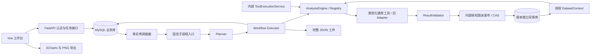

# DataLens 架构

单 Agent、显式计划和确定性工具执行。Planner 接收问题、授权数据集 Schema 和有界会话上下文，输出结构化 ExecutionPlan。Executor 校验工具、参数、依赖、source_ref 和预算后执行；结果在序列化与持久化前验证，模型解释模板中的数值通过类型化事实引用由服务端渲染。Phase 1 的版本基础、迁移运行方法与验证限制见 [phase1.md](phase1.md)。

Phase 2 将计算迁至通用 `app/analysis`。授权与版本加载保留在服务；Context 持有固定版本完整数据；Registry 提供显式发现、类型与权限校验；Agent 和内部调用方共用 AnalysisEngine、执行记录和现有监督任务。工具开发见 [tool-development.md](tool-development.md)，实际能力目录见 [analysis-capabilities.md](analysis-capabilities.md)，验证边界见 [phase2.md](phase2.md)。

上传原文件、规范字段和投影表分开存储；原始名称、类型与质量警告进入元数据。所有权检查先于访问。下游 source_ref 读取完整结果，不能使用裁剪的模型摘要或页面预览继续计算。

初始投影和原文件保留；内部清洗先验证独立工作数据并写入新投影，再锁定 Dataset 校验所有者、任务租约和 source_version=current，发布父子版本。暂存投影和工件文件在写入前登记持久补偿引用，失败/中断只清理未发布资源。V1/V2 读取、排队分析和 SQL 都使用固定版本自己的投影与 Schema；旧 Schema 未记录 storage_type 时只从旧 dtype 推断。DatasetColumns 只表达当前版本。

0007 添加 ToolExecutionRecord、工件的互斥归属和阶段预算。Registry 聊天 manifest 只列出可信权限允许的只读工具，清洗与内部 ChartSpec 2.0 不进入聊天入口。新版八类图表保留内部类型化数据；旧五类 ChartSpec 1.0 与现有前端兼容。无公共通用执行 API。

计划与步骤逐步持久化。API 断开不取消任务，request_id 幂等避免重复付费。父进程监督期限，终止异常子进程；重启终结过期任务、保留证据，不自动从未知步骤续算。所有必需步骤和报告有效才 succeeded；已有计算但后续失败为 partial；无有效计算为 failed。

业务、投影写入和 SQL 查询使用独立账号。SQLGlot 限定单表 SELECT、字段和函数，配合只读连接、结果预算与期限。单机规模复用 MySQL，不使用 Redis/Celery/Multi-Agent/LangGraph；增加 replicas 或 workers 需要重新设计任务调度。

配置与协议以源码为准，导航见 `.ai/index/`。2026-10-02 的真实验收已覆盖MySQL8.0.46、镜像构建、空卷初始化、0005迁移、健康、容器重建卷恢复、HTTP上传/任务及真实投影工具计算。上述为 Phase 1 前的验收记录（当时后端85项通过）；本阶段验证与限制以 phase1.md 为准。用户配置deepseek-flash/Key后，真实地区汇总任务的计划、计算、图表和总结通过；六个月增长真实模型演示仍待验收。
