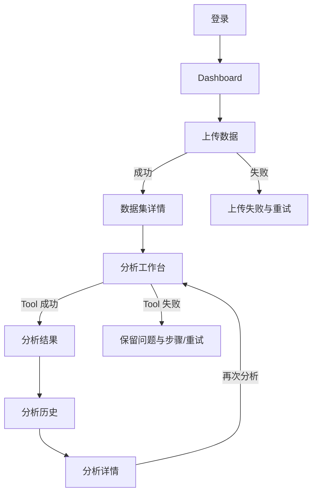

# 页面流程与跳转关系

```mermaid
flowchart TD
  L[登录] --> D[Dashboard]
  D --> U[上传数据]
  U -->|成功| DD[数据集详情]
  U -->|失败| UF[上传失败与重试]
  DD --> W[分析工作台]
  W -->|Tool 成功| R[分析结果]
  W -->|Tool 失败| AF[保留问题与步骤/重试]
  R --> H[分析历史]
  H --> HD[分析详情]
  HD -->|再次分析| W
```

侧栏提供 Dashboard、数据集、智能分析、会话和历史五个稳定入口。Tool 调用详情、图表配置和状态库属于上下文页面，不加入一级导航。
