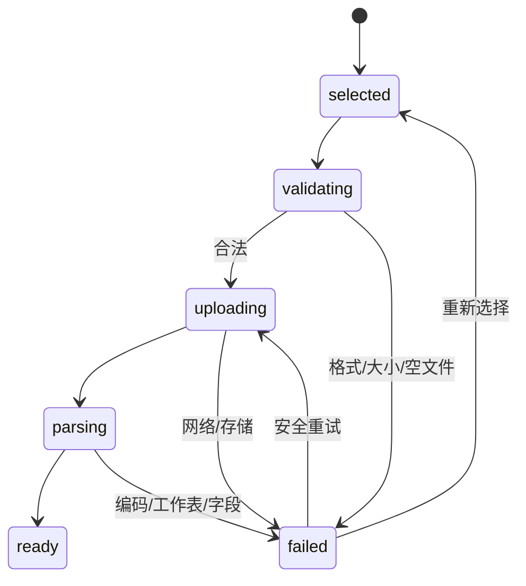

# 数据集管理页面设计

## 页面目标

支持用户上传、验证、解析、查看和删除数据集，并把可分析的数据安全地交给工作台。

## 页面与路径

- 列表 `/datasets`：搜索、类型筛选、分页、查看、分析、删除。
- 上传 `/datasets/upload`：选择、校验、上传、解析与失败恢复。
- 详情 `/datasets/:id`：元信息、质量摘要、预览/字段 Tab。
- 预览 `/datasets/:id/preview`：受限行数表格。
- 字段 `/datasets/:id/columns`：Schema 与质量信息。

## 上传状态机

## 状态设计

- 空列表：解释数据集用途并显示“上传数据”。
- 无搜索结果：显示关键词并提供清除。
- 解析失败：保留文件名和失败阶段，不展示行列统计或分析按钮。
- 字段多：表格独立横向滚动，首列保持可识别。
- 删除：明确级联影响；取消初始焦点；成功后校正分页。

## 组件与接口

DatasetTable、DatasetUploader、UploadQueueItem、DatasetSummary、PreviewTable、ColumnTable、DeleteDatasetDialog。对应上传、列表、详情、删除、预览和字段 API。

## 验收

用户能从列表进入上传，在成功后进入详情并开始分析；格式错误、空文件、解析失败和无权限都有明确原因和恢复动作。
