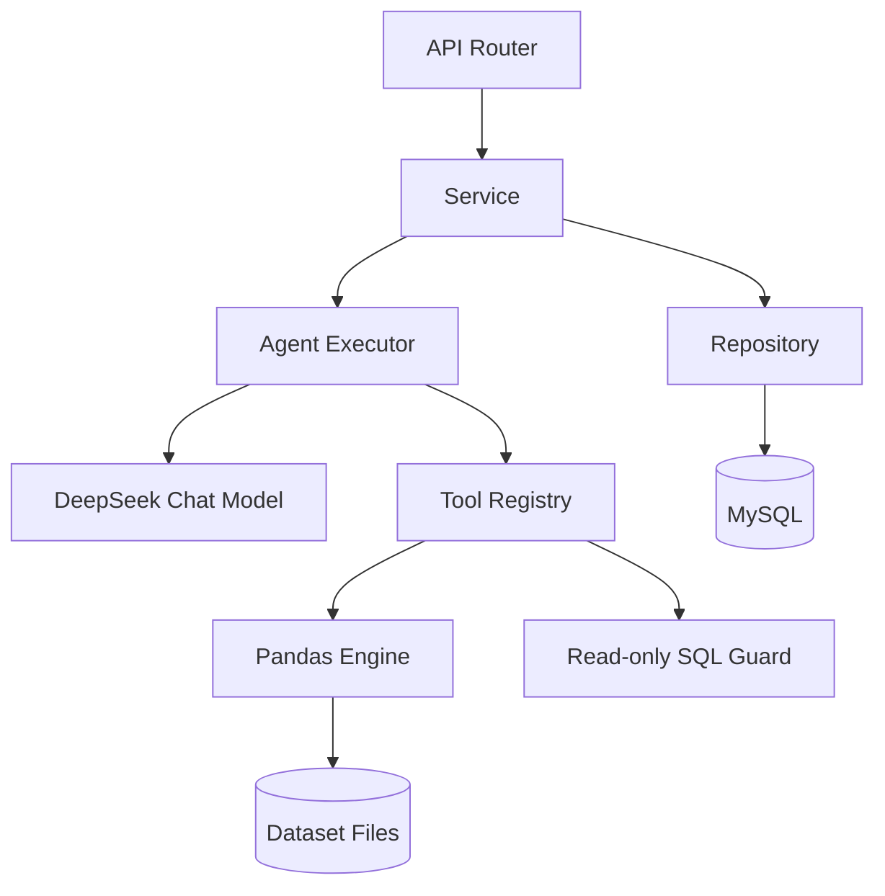

# 后端总体架构

采用模块化单体：API 处理 HTTP，Service 编排用例，Repository 管理持久化，Agent 编排 LLM 与 Tool，Tool 完成确定性数据计算。

```mermaid
flowchart TD
  API[API Router] --> S[Service]
  S --> R[Repository]
  S --> A[Agent Executor]
  A --> L[DeepSeek Chat Model]
  A --> TR[Tool Registry]
  TR --> P[Pandas Engine]
  TR --> SQL[Read-only SQL Guard]
  R --> DB[(MySQL)]
  P --> FS[(Dataset Files)]
```

依赖只能向内：Router 不直接操作 Pandas/SQLAlchemy；Tool 不处理 Request/Response；Repository 不调用 Agent；模型不获得数据库写权限。

