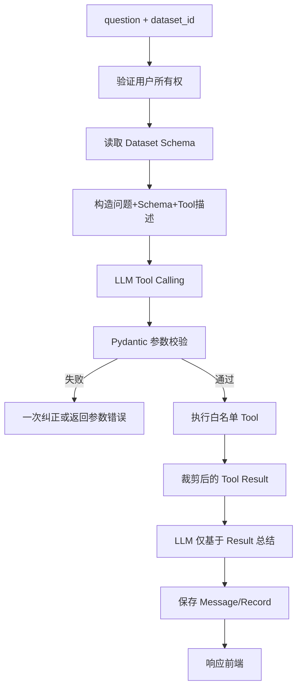

# Agent 架构设计

## 职责

- Agent：组织上下文、选择 Tool、校验与执行、控制循环、组装证据。
- LLM：理解问题、选择 Tool、生成结构化参数、总结 Tool Result。
- Tool：访问受控数据并进行确定性计算。
- Pandas：CSV/XLSX 的筛选、排序、聚合与预览。
- MySQL：用户、元数据、会话、消息和记录；不承担任意用户写 SQL。

## 核心流程

## 上下文策略

Prompt 包含当前问题、会话必要摘要、字段名/类型/缺失/示例和可用 Tool 描述，不包含完整数据集。Tool Result 设置行数和字符上限；超出时保留 schema、统计摘要和分页引用。

## 循环限制

首期每次请求最多 3 次 Tool 调用；参数校验只允许 1 次模型纠正；超时或重复相同失败参数立即停止。禁止 Agent 修改数据库、文件或调用未注册工具。

## 总结约束

System Prompt 明确“只引用 Tool Result；缺少证据时说明无法回答”。记录 tool_call_id，使每个结果和 ChartSpec 可追溯。

