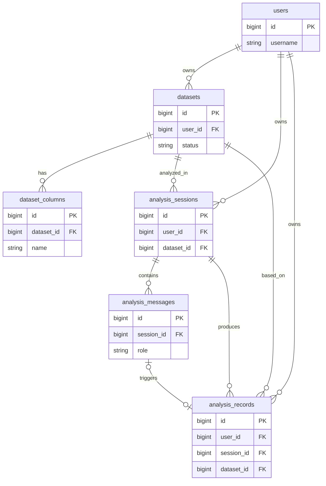

# ER 关系设计

```mermaid
erDiagram
  users ||--o{ datasets : owns
  users ||--o{ analysis_sessions : owns
  users ||--o{ analysis_records : owns
  datasets ||--o{ dataset_columns : has
  datasets ||--o{ analysis_sessions : analyzed_in
  analysis_sessions ||--o{ analysis_messages : contains
  analysis_sessions ||--o{ analysis_records : produces
  datasets ||--o{ analysis_records : based_on
  analysis_messages o|--o| analysis_records : triggers

  users { bigint id PK string username }
  datasets { bigint id PK bigint user_id FK string status }
  dataset_columns { bigint id PK bigint dataset_id FK string name }
  analysis_sessions { bigint id PK bigint user_id FK bigint dataset_id FK }
  analysis_messages { bigint id PK bigint session_id FK string role }
  analysis_records { bigint id PK bigint user_id FK bigint session_id FK bigint dataset_id FK }
```

`analysis_records.user_message_id` 指向触发本次执行的用户消息；`assistant_message_id` 在成功或可展示 Tool Result 时指向助手消息。为了保持图简洁，以可选一对一表示。

