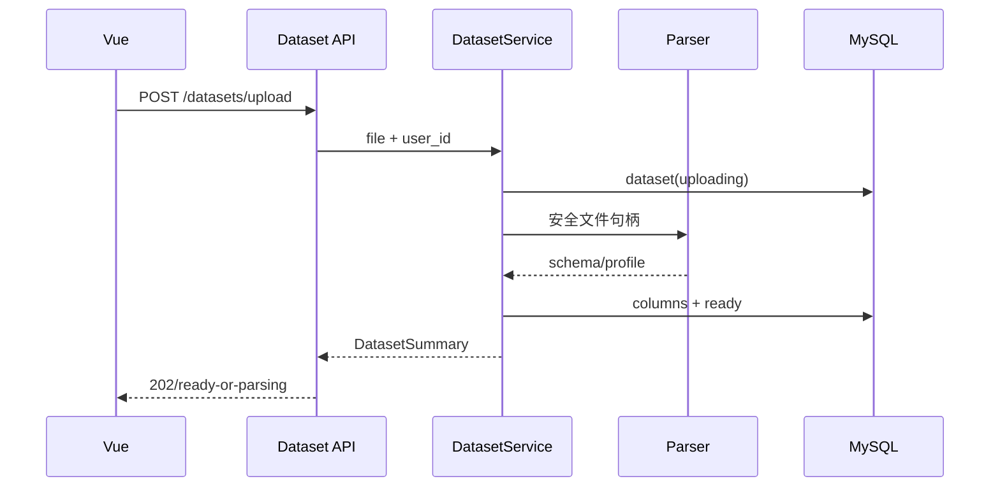
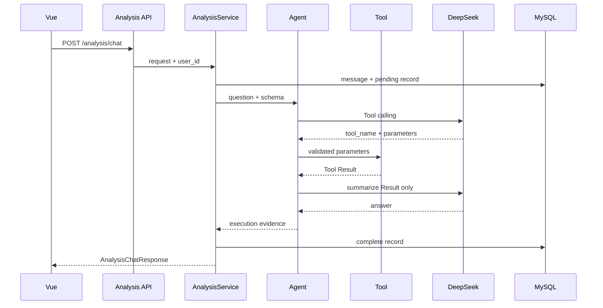

# 接口调用时序

## 上传

```mermaid
sequenceDiagram
  participant V as Vue
  participant A as Dataset API
  participant S as DatasetService
  participant P as Parser
  participant D as MySQL
  V->>A: POST /datasets/upload
  A->>S: file + user_id
  S->>D: dataset(uploading)
  S->>P: 安全文件句柄
  P-->>S: schema/profile
  S->>D: columns + ready
  S-->>A: DatasetSummary
  A-->>V: 202/ready-or-parsing
```

## 智能分析

```mermaid
sequenceDiagram
  participant V as Vue
  participant A as Analysis API
  participant S as AnalysisService
  participant G as Agent
  participant T as Tool
  participant M as DeepSeek
  participant D as MySQL
  V->>A: POST /analysis/chat
  A->>S: request + user_id
  S->>D: message + pending record
  S->>G: question + schema
  G->>M: Tool calling
  M-->>G: tool_name + parameters
  G->>T: validated parameters
  T-->>G: Tool Result
  G->>M: summarize Result only
  M-->>G: answer
  G-->>S: execution evidence
  S->>D: complete record
  S-->>V: AnalysisChatResponse
```

